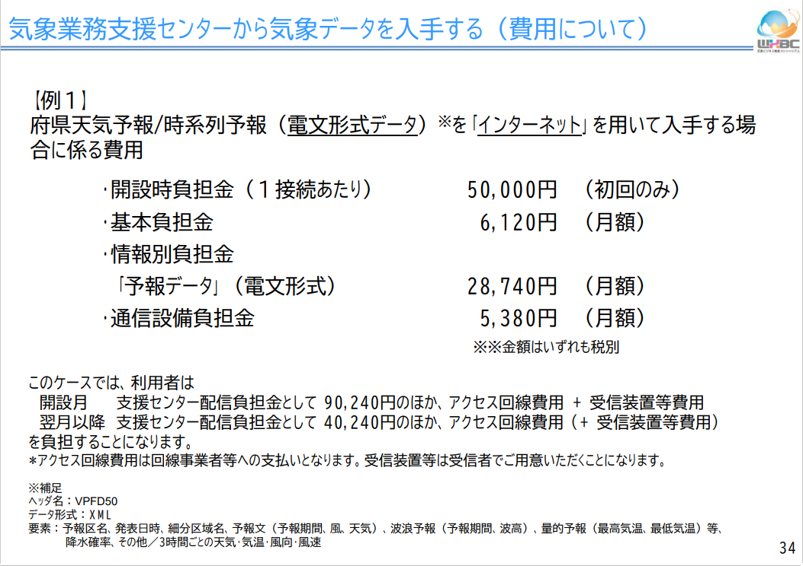

```{r setup, include=FALSE}
knitr::opts_chunk$set(echo = TRUE)
```

# リンク集

 <!-- - [enecast](https://enecast.dip.jp/) -->
 
 - [気象庁HP](https://www.jma.go.jp/jma/index.html)
 
 - [気象官署](https://www.jma.go.jp/jma/kishou/link/link2.html)  :  気象観測や 天気予報 の予報業務を行う公的機関。  
 
 - [気象予報について](https://www.jma.go.jp/jma/kishou/know/whitep/1-3-1.html)
 
 - 気象データ入手
 
   - [最新の気象データ](http://www.data.jma.go.jp/obd/stats/data/mdrr/index.html)
 
   - [過去の気象データ検索](http://www.data.jma.go.jp/obd/stats/etrn/index.php)
 
   - [過去の気象データ・ダウンロード](http://www.data.jma.go.jp/gmd/risk/obsdl/index.php)
 
 - [気象庁数値予報モデル](https://www.jma.go.jp/jma/kishou/know/whitep/1-3-4.html)

     - [数値予報研修テキスト](http://www.jma.go.jp/jma/kishou/books/nwptext/nwptext.html)
     
     - [数値予報解説資料集](http://www.jma.go.jp/jma/kishou/books/nwpkaisetu/53/No53_all.pdf)
         
         - 表紙・はじめに・目次（ 140 KB ）
         - 第１章：基礎編
           - 概要（ 1.6 MB ）
           - 観測データと品質管理（ 2.8 MB ）
           - データ同化（ 1.2 MB ）
           - 数値予報モデル（ 2.5 MB ）
           - アンサンブル予報（ 1.8 MB ）
           - ガイダンス（ 1.5 MB ）
           - 気象庁の現業数値予報システム（ 490 KB ）
           - 全球解析（ 1.8 MB ）
           - 全球モデル（ 1.5 MB ）
           - 全球アンサンブル予報システム（ 1.0 MB ）
           - メソ解析（ 1.3 MB ）
           - メソモデル（ 1.3 MB ）
           - メソアンサンブル予報システム（ 1.1 MB ）
           - 局地解析（ 1.0 MB ）
           - 局地モデル（ 1.0 MB ）
           - プロダクト利用上の留意点（ 5.4 MB ）
         - 第2章：応用編
           - 全球解析の改良（ 2.2 MB ）
           - 全球モデルの物理過程の改良（ 1.7 MB ）
           - メソ数値予報システムの改良（ 4.2 MB ）
           - 観測データ利用の変更（ 3.6 MB ）
           - メソアンサンブル予報システムの改良（ 4.0 MB ）
           - 統合型ガイダンス（ 1.0 MB ）
         - 第３章：事例解析編
           - 令和2年7月豪雨の数値予報の結果（ 7.9 MB ）
           - 令和2年の台風の数値予報の結果（ 6.2 MB ）
         - 第4章：資料編
           - 数値予報システムの概要一覧（ 670 KB ）
           - ガイダンスの概要一覧表（ 170 KB ）
           - プロダクトの送信時刻（ 63 KB ）
           - 最近の改善のまとめ（ 230 KB ）
           - プロダクトの物理量の仕様及び算出方法（ 230 KB ）
           - 表記と統計的検証に用いる代表的な指標（ 1.0 MB ）  
           
           
           

# 気象に関する数値予報モデルの種類

 - [気象庁リンク](https://www.jma.go.jp/jma/kishou/know/whitep/1-3-4.html)
 - [WXBCリンク ←　わかりやすい](https://www.wxbc.jp/wp-content/uploads/2017/09/seminar_0926_00.pdf)

<div align="center">

</div>
  
<div align="center">

</div>

  
<div align="center">

</div>


## 全球モデル（GSM）

 - [気象庁リンク](http://www.jma.go.jp/jma/kishou/know/whitep/1-3-5.html)
 - [過去２４時間の予報図のリンク](http://www.jma.go.jp/bosai/numericmap/#type=nwp)
 - [データ概要リンク](http://www.jmbsc.or.jp/jp/online/file/f-online10100.html#gl)


ヨーロッパや低緯度地域の大気の状態も、数日後には日本に影響を与えます。このため、数日より先の予報には地球全体をカバーする全球モデル。全球モデルでは、日本が位置する温帯域だけでなく、気象特性が異なる熱帯域や極域の気象も適切に予測することが重要

気象庁では全球数値予報モデルの計算結果を図示化した数値予報天気図を1日2回（一部資料は1日1回）作成している。

### 要素(日本域)

 - 地上：
   - 海面更正気圧、風（２要素）、気温、相対湿度、積算降水量、雲量（４要素）、地上気圧、日射量

 - 1000hPa・975hPa・950hPa・925hPa・900hPa・850hPa・800hPa・700hPa・600hPa・500hPa・400hPa・300hPa：
   - 高度、風（２要素）、気温、上昇流、相対湿度

- 250hPa・200hPa・150hPa・100hPa：
   - 高度、風（２要素）、気温、上昇流

※1： 風（２要素）とは、東西成分と南北成分。  
※2： 雲量（４要素）とは、全雲量、上層雲、中層雲、下層雲。

<!-- <div align="center"> -->
<!--  -->
<!-- </div> -->


## メソモデル（MSM）

 - [気象庁リンク](https://www.jma.go.jp/jma/kishou/know/whitep/1-3-6.html)
 - [データ概要リンク](http://www.jmbsc.or.jp/jp/online/file/f-online10200.html)

メソモデルは、
  
  - 全球モデルより細かい水平格子間隔5kmで日本とその近海を計算領域
  - 1日8回（3時間ごと）
  - 39時間先までの予測計算（51時間先は00,12UTC初期値のみ）
  
  を行っており、数時間から1日先の大雨や暴風などの災害をもたらす現象を予測することを主要な目的としています。  


### 要素

 - 地上：
   - 海面更正気圧、地上気圧、風（２要素）、気温、相対湿度、時間降水量、雲量（４要素）、日射量 

 - 1000hPa・975hPa・950hPa・925hPa・900hPa・850hPa・800hPa・700hPa・600hPa・500hPa・400hPa・300hPa：
   - 高度、風（２要素）、気温、上昇流、相対湿度
 
 - 250hPa・200hPa・150hPa・100hPa：
   - 高度、風（２要素）、気温、上昇流

### 初期値

 - （39時間予報）03，06，09，15，18，21UTC（１日６回）
 - （51時間予報）00，12UTC（１日２回）

### 配信時刻

 - 初期時刻＋２時間30分後（例えば、初期時刻：00UTC の場合、11時30分（日本時間）頃までに配信）

### 予報時間

 - 地上は１時間間隔、気圧面は３時間間隔


### 配信領域
 - 北緯 22.4度～47.6度、東経 120度～150度  
 （47.6N, 120.0E）を北西端、（22.4E, 150.0E）を南東端とする領域

  
<div align="center">

</div>

### 格子系
 - 等緯度等経度  
   - 地上： 0.05度×0.0625度（格子数 481×505）
   - 気圧面： 0.1度×0.125度（格子数 241×253）

### サイズ
 - （39時間予報）約293MB/回×６回＝1,758MB/日
 - （51時間予報）約380MB/回×２回＝760MB/日

### 注意事項
 - 気象庁システムの障害等により初期時刻から４時間以内に配信をできない場合は、当該時刻の配信を中止することがある

<!-- <div align="center"> -->
<!--  -->
<!-- </div> -->


<!-- <div align="center"> -->
<!--  -->
<!-- </div> -->


## 局地モデル（LFM）

 - [データ概要リンク](http://www.jmbsc.or.jp/jp/online/file/f-online10300.html)
 
 
局地モデルは、
 
  - メソモデルより細かい水平格子間隔(2km)
  - 1日24回（毎時）
  - 10時間先までの予測計算

を行っており、目先数時間程度の局地的な大雨の発生ポテンシャルの把握に利用されています。


### 要素

 - 地上：
   - 海面更正気圧、地上気圧、風（２要素）、気温、相対湿度、積算降水量、雲量（４要素）、日射量
 
 - 1000hPa・975hPa・950hPa・925hPa・900hPa・850hPa・800hPa・700hPa・600hPa・500hPa・400hPa・300hPa：
   - 高度、風（２要素）、気温、上昇流、相対湿度
   
 - 250hPa・200hPa・150hPa・100hPa：
   - 高度、風（２要素）、気温、上昇流
   
### 初期値

 - 毎正時（１日24回）

### 配信時刻

 - 初期時刻＋１時間30分後  
 （例えば、初期時刻：00UTC の場合、10時30分（日本時間）頃までに配信）

### 予報時間

 - 10時間 (地上は30分間隔、気圧面は１時間間隔)


### 配信領域
 - 北緯 22.4度～47.6度、東経 120度～150度  
 （47.6N, 120.0E）を北西端、（22.4E, 150.0E）を南東端とする領域
 
   
<div align="center">

</div>

### 格子系

 - 等緯度等経度
   - 地上： 0.020度×0.025度（格子数 1261×1201）
   - 気圧面： 0.040度×0.050度（格子数 631×601）

### サイズ等

 - 平成31(2019)年３月５日03UTC初期値の資料から
   - （約21.1MB×1ファイル＋約25.3MB×20ファイル＋約48.3MB×11ファイル）×24回＝約25.4GB/日。

### 注意事項

 - 気象庁システムの障害等により初期時刻から２時間以内に配信ができない場合は、当該時刻の配信資料の提供を中止することがある。
 - データサイズが非常に大きいため、受信するための回線は30MBbps以上の回線を推奨。


# データの入手方法

 

 - [WXBCリンク（20Pあたり）](https://www.wxbc.jp/wp-content/uploads/2017/09/seminar_0926_00.pdf)

## 気象データ⾼度利⽤ポータルサイト

 - [気象データ⾼度利⽤ポータルサイト リンク](http://www.data.jma.go.jp/developer/)

気象庁HPで公開しているデータがあるが、気象庁の全てのデータが公開されている訳ではない。


<div align="center">

</div>


<div align="center">

</div>


## 気象業務支援センター

 - [気象業務支援センター リンク](http://www.jmbsc.or.jp/jp/)
 - [気象業務支援センター 配信サービスパンフレット](http://www.jmbsc.or.jp/jp/online/pamphlet.pdf)
 
 - 概要
 
   - 気象業務法により⺠間気象業務⽀援センターとして指定された（⼀財）気象業務⽀援センターが、気象庁の保有する情報のオンライン・オフラインでの提供を⾏っています。  
 
   - オンラインの情報提供では、24時間365日、注意報・警報、地震津波情報等を安定・確実に提供するため、システムを全て冗⻑系として整備し、常時監視体制のもと運⽤されています。  
 
   - 危機管理上重要な緊急地震速報を含む防災情報を中⼼に、⼤阪管区気象台にバックアップシステムを整備・運用して提供されています。なお、（公益目的支出事業として）無償※で利⽤者に提供されています。  
 
   - システムの整備に際しては、有識者、利⽤者、気象庁で構成される配信事業検討委員会において検討いただき、助言がなされています。
 
   - データ利⽤の負担⾦については、システムの整備・運⽤に必要な経費で、利⽤者やシステム等の動向を踏まえて概ね３年毎に⾒直されており、配信事業検討委員会の助⾔も受けつつ、気象庁の認可が得られています。なお、負担⾦の算定は、データの種類毎にデータ量に基づき⾏われています。
 
 
### 配信データの種類

 - [電文形式データ](http://www.jmbsc.or.jp/jp/online/denbun/D_datalist.pdf)
   - 気象庁の気象資料⾃動編集中継装置（アデス）から配信される、主に文字情報等の電文形式気象データが分岐配信されます。
    
 - [**ファイル形式データ**](http://www.jmbsc.or.jp/jp/online/file/F_filelist.pdf)
   - 気象庁のスーパーコンピュータシステム等で作成されたGPVデータ（格子点データ）や気象レーダー等の気象データがファイルとして分岐配信されます。
   
 - 緊急地震速報
   - 気象庁の地震活動等総合監視システム（EPOS）から配信される、緊急地震速報データが分岐配信されます。
   
 - [気象衛星観測データ](http://www.jmbsc.or.jp/jp/online/satellite/S_filelist.pdf)
   - 静止気象衛星ひまわりで観測されたデータが、ファイルデータとして分岐配信されます。
   
   
<div align="center">





</div>


# その他

## 予報業務の許可
<div align="center">

</div>


